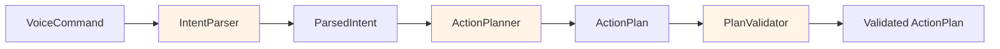
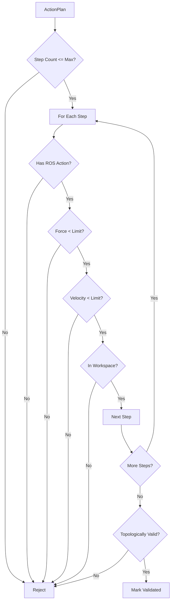

# Cognitive Planning Layer

The Cognitive Planning Layer transforms natural language commands into validated, executable action plans using LLM-based reasoning.

## Layer Components



## IntentParser

**Purpose**: Extract structured intent from natural language using LLM

**Location**: `src/vla_core/cognition/intent_parser.py`

### Key Features

- **LLM-Powered NLU**: Uses GPT-4 for natural language understanding
- **Structured Output**: Pydantic model validation for reliability
- **Ambiguity Detection**: Identifies unclear commands
- **Parameter Extraction**: Extracts action parameters from free text

### Implementation

```python
class IntentParser(IIntentParser):
    def __init__(self, config: VLAConfig):
        self.config = config
        self.llm_client = LLMClient(config)

        # Load system prompt from template
        prompt_path = Path(__file__).parent / "prompts" / "intent_parser_prompt.md"
        with open(prompt_path, "r") as f:
            self.system_prompt = f.read()

    async def parse(self, command: VoiceCommand) -> ParsedIntent:
        """Parse voice command to structured intent."""
        logger.info(
            "Parsing intent",
            command_id=str(command.id),
            text=command.transcribed_text,
        )

        try:
            # Call LLM with structured output
            parsed_data = await self.llm_client.structured_completion(
                system_prompt=self.system_prompt,
                user_message=command.transcribed_text,
                response_model=ParsedIntent,
            )

            # Set command reference
            parsed_data.command_id = command.id

            # Validate parameters for action type
            if not parsed_data.validate_parameters_for_action():
                logger.warning(
                    "Intent validation failed",
                    action_type=parsed_data.action_type,
                    ambiguities=parsed_data.ambiguities,
                )

            logger.info(
                "Intent parsed successfully",
                action_type=parsed_data.action_type,
                target_objects=len(parsed_data.target_objects),
                requires_clarification=parsed_data.requires_clarification,
            )

            return parsed_data

        except Exception as e:
            raise ParsingError(
                f"Failed to parse intent: {str(e)}",
                recoverable=True,
                command_text=command.transcribed_text,
            ) from e
```

### System Prompt

The intent parser uses a detailed system prompt (`prompts/intent_parser_prompt.md`):

````markdown
# Intent Parser System Prompt

You are an intent parser for a humanoid robot control system. Your task is to convert natural language commands into structured action intents.

## Available Action Types

- **PICK**: Grasp an object
- **PLACE**: Release object at location
- **NAVIGATE**: Move to position
- **INSPECT**: Visual examination
- **HANDOVER**: Transfer object to person

## Robot Capabilities

- 7-DOF right arm
- 2-finger parallel gripper
- Base mobility (omnidirectional)
- RGB-D camera for perception

## Output Format

Return JSON matching this schema:

```json
{
  "action_type": "PICK",
  "target_objects": [
    {
      "name": "red block",
      "type": "block",
      "color": "red",
      "confidence": 0.9
    }
  ],
  "parameters": {
    "grasp_type": "top",
    "approach_offset": {"z": 0.1}
  },
  "ambiguities": [],
  "requires_clarification": false
}
```

## Parameter Guidelines

### PICK Action
- `grasp_type`: "top" | "side" | "pinch"
- `approach_offset`: z offset for pre-grasp pose (default 0.1m)
- `max_force`: Maximum gripper force (default 30N)

### PLACE Action
- `placement_type`: "drop" | "gentle"
- `target_location`: Description or coordinates
- `orientation`: Desired object orientation

### NAVIGATE Action
- `target_pose`: {x, y, theta} in meters/radians
- `target_location`: Description (e.g., "near the table")
- `max_velocity`: Maximum speed (default 0.3 m/s)

## Ambiguity Detection

Set `requires_clarification=true` if:
- Multiple objects match description
- Target location is vague
- Action sequence is unclear
- Missing critical parameters

List specific ambiguities in the `ambiguities` array.

## Examples

**Input**: "Pick up the red block"
**Output**:
```json
{
  "action_type": "PICK",
  "target_objects": [{"name": "red block", "type": "block", "color": "red", "confidence": 0.95}],
  "parameters": {"grasp_type": "top", "approach_offset": {"z": 0.1}},
  "ambiguities": [],
  "requires_clarification": false
}
```

**Input**: "Put the thing on the shelf"
**Output**:
```json
{
  "action_type": "PLACE",
  "target_objects": [{"name": "unspecified object", "type": "unknown", "confidence": 0.3}],
  "parameters": {"target_location": "shelf", "placement_type": "gentle"},
  "ambiguities": ["Object not specified - which thing?", "Shelf location ambiguous"],
  "requires_clarification": true
}
```
````

### Validation Logic

```python
# In ParsedIntent model
def validate_parameters_for_action(self) -> bool:
    """Validate that required parameters are present for action type."""
    if self.action_type == ActionType.PICK:
        if not self.target_objects:
            self.ambiguities.append("No target object specified for PICK")
            self.requires_clarification = True
            return False

        # Check grasp_type parameter
        if "grasp_type" not in self.parameters:
            self.parameters["grasp_type"] = "top"  # Default

    elif self.action_type == ActionType.PLACE:
        if "target_location" not in self.parameters:
            self.ambiguities.append("No placement location specified")
            self.requires_clarification = True
            return False

    elif self.action_type == ActionType.NAVIGATE:
        if "target_pose" not in self.parameters and "target_location" not in self.parameters:
            self.ambiguities.append("No navigation target specified")
            self.requires_clarification = True
            return False

    return True
```

## ActionPlanner

**Purpose**: Decompose high-level intents into multi-step action sequences

**Location**: `src/vla_core/cognition/action_planner.py`

### Key Features

- **Multi-Step Planning**: Breaks complex tasks into atomic actions
- **Topological Ordering**: Ensures logical action sequence
- **Precondition Checking**: Validates plan feasibility
- **LLM-Based Reasoning**: Uses GPT-4 for plan generation

### Implementation

```python
class ActionPlanner(IActionPlanner):
    def __init__(self, config: VLAConfig):
        self.config = config
        self.llm_client = LLMClient(config)

        # Load planning prompt
        prompt_path = Path(__file__).parent / "prompts" / "action_planner_prompt.md"
        with open(prompt_path, "r") as f:
            self.system_prompt = f.read()

    async def generate_plan(self, intent: ParsedIntent) -> ActionPlan:
        """Generate multi-step action plan from intent."""
        logger.info(
            "Generating action plan",
            intent_id=str(intent.command_id),
            action_type=intent.action_type,
        )

        # Format intent as user message
        user_message = self._format_intent_for_planning(intent)

        try:
            # Call LLM for plan generation
            plan_response = await self.llm_client.structured_completion(
                system_prompt=self.system_prompt,
                user_message=user_message,
                response_model=PlanResponse,
            )

            # Convert to ActionPlan with RobotAction steps
            plan = self._convert_to_action_plan(intent, plan_response)

            logger.info(
                "Plan generated successfully",
                plan_id=str(plan.plan_id),
                num_steps=len(plan.steps),
                estimated_duration=plan.estimated_duration,
            )

            return plan

        except Exception as e:
            raise PlanningError(
                f"Failed to generate plan: {str(e)}",
                recoverable=True,
                intent_summary=str(intent.action_type),
            ) from e

    def _format_intent_for_planning(self, intent: ParsedIntent) -> str:
        """Format intent as planning prompt."""
        obj_desc = ", ".join([o.name for o in intent.target_objects])

        return f"""
Action Type: {intent.action_type}
Target Objects: {obj_desc}
Parameters: {json.dumps(intent.parameters, indent=2)}

Generate a detailed, multi-step action plan to accomplish this task.
Consider navigation, manipulation, and sensing requirements.
"""

    def _convert_to_action_plan(
        self, intent: ParsedIntent, plan_response: PlanResponse
    ) -> ActionPlan:
        """Convert LLM response to ActionPlan with RobotAction steps."""
        robot_actions = []

        for i, step_data in enumerate(plan_response.steps):
            action = RobotAction(
                action_type=ActionType(step_data["action_type"]),
                ros_action_name=step_data["ros_action_name"],
                goal_message=step_data["goal_message"],
                timeout=step_data.get("timeout", 10.0),
                constraints=RobotActionConstraints(
                    max_force=step_data.get("max_force", 50.0),
                    max_velocity=step_data.get("max_velocity", 0.5),
                    workspace_bounds=self.config.workspace_bounds,
                ),
            )
            robot_actions.append(action)

        return ActionPlan(
            intent_id=intent.command_id,
            steps=robot_actions,
            preconditions=plan_response.preconditions,
            expected_outcomes=plan_response.expected_outcomes,
            estimated_duration=plan_response.estimated_duration,
        )
```

### Planning Examples

**Simple PICK Action**:
```json
{
  "steps": [
    {
      "action_type": "navigate",
      "ros_action_name": "/navigate_to_point",
      "goal_message": {"target_pose": {"x": 2.0, "y": 1.0, "theta": 0.0}},
      "timeout": 10.0
    },
    {
      "action_type": "pick",
      "ros_action_name": "/pick_object",
      "goal_message": {"object_id": "red_block_1", "grasp_type": "top"},
      "timeout": 8.0
    }
  ],
  "preconditions": ["Red block is visible", "Gripper is empty"],
  "expected_outcomes": ["Red block grasped securely"],
  "estimated_duration": 18.0
}
```

**Complex PICK-and-PLACE**:
```json
{
  "steps": [
    {
      "action_type": "navigate",
      "ros_action_name": "/navigate_to_point",
      "goal_message": {"target_location": "near table"}
    },
    {
      "action_type": "inspect",
      "ros_action_name": "/inspect_object",
      "goal_message": {"object_query": "red block"}
    },
    {
      "action_type": "pick",
      "ros_action_name": "/pick_object",
      "goal_message": {"object_id": "detected_object_1"}
    },
    {
      "action_type": "navigate",
      "ros_action_name": "/navigate_to_point",
      "goal_message": {"target_location": "shelf"}
    },
    {
      "action_type": "place",
      "ros_action_name": "/place_object",
      "goal_message": {"placement_location": "shelf_top"}
    }
  ],
  "estimated_duration": 45.0
}
```

## PlanValidator

**Purpose**: Verify plan safety and feasibility before execution

**Location**: `src/vla_core/cognition/plan_validator.py`

### Key Features

- **Safety Checks**: Joint limits, force limits, workspace bounds
- **Topological Validation**: Ensures logical action ordering
- **Precondition Verification**: Checks initial conditions
- **Conflict Detection**: Identifies impossible sequences

### Implementation

```python
class PlanValidator(IPlanValidator):
    def __init__(self, config: VLAConfig):
        self.config = config

    async def validate(self, plan: ActionPlan) -> Tuple[bool, List[str]]:
        """Validate action plan for safety and feasibility."""
        errors = []

        logger.info("Validating plan", plan_id=str(plan.plan_id))

        # 1. Check step count
        if len(plan.steps) > self.config.max_plan_steps:
            errors.append(
                f"Plan exceeds maximum steps: {len(plan.steps)} > {self.config.max_plan_steps}"
            )

        # 2. Validate each step
        for i, step in enumerate(plan.steps):
            step_errors = self._validate_step(step, i)
            errors.extend(step_errors)

        # 3. Check topological consistency
        topo_errors = self._validate_topological_consistency(plan)
        errors.extend(topo_errors)

        # 4. Verify preconditions (if available)
        # TODO: Integrate with perception system

        is_valid = len(errors) == 0

        if is_valid:
            plan.mark_validated()
            logger.info("Plan validated successfully", plan_id=str(plan.plan_id))
        else:
            for error in errors:
                plan.add_validation_error(error)
            logger.warning(
                "Plan validation failed",
                plan_id=str(plan.plan_id),
                error_count=len(errors),
            )

        return (is_valid, errors)

    def _validate_step(self, step: RobotAction, step_index: int) -> List[str]:
        """Validate a single action step."""
        errors = []

        # Check required fields
        if not step.ros_action_name:
            errors.append(f"Step {step_index}: Missing ROS action name")

        if not step.goal_message:
            errors.append(f"Step {step_index}: Missing goal message")

        # Check constraints
        if step.constraints.max_force > self.config.max_force_threshold:
            errors.append(
                f"Step {step_index}: Force limit exceeded ({step.constraints.max_force}N > {self.config.max_force_threshold}N)"
            )

        if step.constraints.max_velocity > self.config.max_velocity_threshold:
            errors.append(
                f"Step {step_index}: Velocity limit exceeded ({step.constraints.max_velocity}m/s)"
            )

        # Check workspace bounds (if position specified)
        if "target_pose" in step.goal_message:
            pose = step.goal_message["target_pose"]
            if not self._is_in_workspace(pose):
                errors.append(f"Step {step_index}: Target pose outside workspace bounds")

        # Check timeout
        if step.timeout > self.config.action_timeout_max:
            errors.append(
                f"Step {step_index}: Timeout too long ({step.timeout}s > {self.config.action_timeout_max}s)"
            )

        return errors

    def _validate_topological_consistency(self, plan: ActionPlan) -> List[str]:
        """Ensure actions are in valid order."""
        errors = []

        has_picked_object = False

        for i, step in enumerate(plan.steps):
            if step.action_type == ActionType.PICK:
                has_picked_object = True

            elif step.action_type == ActionType.PLACE:
                if not has_picked_object:
                    errors.append(
                        f"Step {i}: Cannot PLACE without PICK first (invalid sequence)"
                    )

        return errors

    def _is_in_workspace(self, pose: dict) -> bool:
        """Check if pose is within robot's workspace."""
        bounds = self.config.workspace_bounds

        x, y, z = pose.get("x", 0), pose.get("y", 0), pose.get("z", 0)

        return (
            bounds["x_min"] <= x <= bounds["x_max"]
            and bounds["y_min"] <= y <= bounds["y_max"]
            and bounds["z_min"] <= z <= bounds["z_max"]
        )
```

### Validation Checks

| Check | Purpose | Configuration |
|-------|---------|---------------|
| Step Count | Prevent overly complex plans | `MAX_PLAN_STEPS=10` |
| Force Limits | Prevent gripper damage | `MAX_FORCE_THRESHOLD=50.0` (Newtons) |
| Velocity Limits | Safety constraint | `MAX_VELOCITY_THRESHOLD=0.5` (m/s) |
| Workspace Bounds | Reachability check | `WORKSPACE_BOUNDS={...}` |
| Topological Order | Logical consistency | Hardcoded rules |
| Timeout Limits | Prevent hanging | `ACTION_TIMEOUT_MAX=60.0` |

### Validation Flow



## LLMClient

**Purpose**: Wrapper for OpenAI API with structured output support

**Location**: `src/vla_core/cognition/llm_client.py`

### Key Features

- **Structured Output**: Pydantic model validation
- **Retry Logic**: Exponential backoff on failures
- **Response Caching**: Avoid redundant API calls
- **Async Execution**: Non-blocking LLM calls

### Implementation

```python
class LLMClient:
    def __init__(self, config: VLAConfig):
        self.config = config
        self.client = openai.AsyncOpenAI(api_key=config.openai_api_key)
        self._cache: Dict[str, str] = {}

    async def chat_completion(
        self,
        system_prompt: str,
        user_message: str,
        model: Optional[str] = None,
        temperature: float = 0.7,
        response_format: Optional[dict] = None,
    ) -> str:
        """Call OpenAI chat completion API."""
        model = model or self.config.openai_model

        # Check cache
        cache_key = f"{system_prompt}|{user_message}|{model}|{temperature}"
        if cache_key in self._cache:
            logger.debug("LLM cache hit")
            return self._cache[cache_key]

        messages = [
            {"role": "system", "content": system_prompt},
            {"role": "user", "content": user_message},
        ]

        logger.info("Calling LLM", model=model, temperature=temperature)

        try:
            response = await self.client.chat.completions.create(
                model=model,
                messages=messages,
                temperature=temperature,
                response_format=response_format,
            )

            content = response.choices[0].message.content
            self._cache[cache_key] = content

            return content

        except Exception as e:
            logger.error("LLM call failed", error=str(e))
            raise

    async def structured_completion(
        self,
        system_prompt: str,
        user_message: str,
        response_model: type[BaseModel],
        max_retries: int = 3,
    ) -> BaseModel:
        """Get structured output validated by Pydantic model."""
        for attempt in range(max_retries):
            try:
                # Request JSON response
                response_text = await self.chat_completion(
                    system_prompt=system_prompt,
                    user_message=user_message,
                    response_format={"type": "json_object"},
                    temperature=0.7 + (attempt * 0.1),  # Increase temp on retry
                )

                # Parse and validate
                response_json = json.loads(response_text)
                validated = response_model(**response_json)

                return validated

            except (json.JSONDecodeError, ValidationError) as e:
                logger.warning(
                    "Structured output validation failed",
                    attempt=attempt + 1,
                    error=str(e),
                )

                if attempt == max_retries - 1:
                    raise ParsingError(
                        f"Failed to get valid structured output after {max_retries} attempts",
                        recoverable=False,
                    ) from e
```

## Configuration

```python
# In .env
OPENAI_API_KEY=sk-...
OPENAI_MODEL=gpt-4-turbo-preview
OPENAI_TEMPERATURE=0.7
OPENAI_MAX_TOKENS=2048

MAX_PLAN_STEPS=10
MAX_FORCE_THRESHOLD=50.0
MAX_VELOCITY_THRESHOLD=0.5
ACTION_TIMEOUT_MAX=60.0

WORKSPACE_BOUNDS='{"x_min": -1.0, "x_max": 3.0, "y_min": -2.0, "y_max": 2.0, "z_min": 0.0, "z_max": 2.0}'
```

## Performance

| Operation | Latency | Notes |
|-----------|---------|-------|
| Intent Parsing | 800-1500ms | GPT-4 API call |
| Action Planning | 1000-2500ms | Depends on plan complexity |
| Plan Validation | 10-50ms | Local computation |
| **Total (Voice→Plan)** | **2-4 seconds** | Target < 3s |

## Testing

```python
# tests/unit/test_cognition/test_intent_parser.py
@pytest.mark.asyncio
async def test_parse_pick_command(mock_config):
    parser = IntentParser(mock_config)

    # Mock LLM response
    parser.llm_client.structured_completion = AsyncMock(
        return_value=ParsedIntent(
            command_id=uuid4(),
            action_type=ActionType.PICK,
            target_objects=[ObjectReference(name="red block", type="block", color="red")],
            parameters={"grasp_type": "top"},
            ambiguities=[],
            requires_clarification=False,
        )
    )

    command = VoiceCommand(
        audio_buffer=b"test",
        transcribed_text="Pick up the red block",
        confidence=0.95,
    )

    intent = await parser.parse(command)

    assert intent.action_type == ActionType.PICK
    assert len(intent.target_objects) == 1
    assert intent.target_objects[0].name == "red block"
    assert not intent.requires_clarification
```

## Next Steps

- [Execution Layer Details](execution-layer)
- [Complete Sequence Flow](sequence-flow)
- [API Reference](../api/overview)