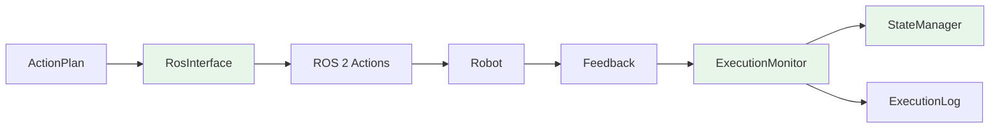
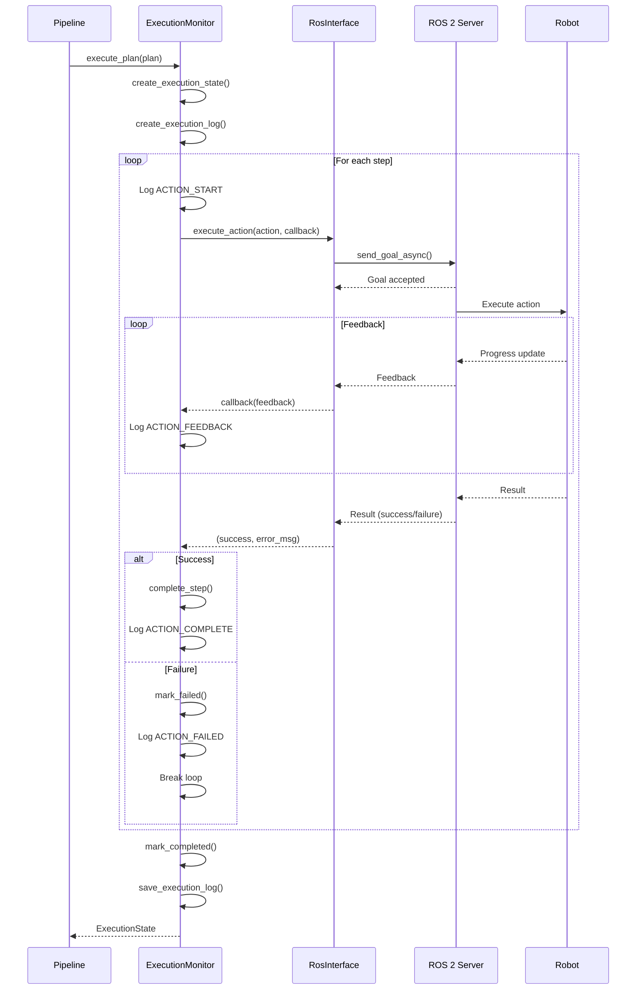

# Execution Layer

The Execution Layer coordinates the execution of validated action plans on the physical robot through ROS 2, with real-time monitoring and comprehensive logging.

## Layer Components



## RosInterface

**Purpose**: Bridge between VLA pipeline and ROS 2 action servers

**Location**: `src/vla_core/execution/ros_interface.py`

### Key Features

- **ROS 2 Action Client**: Asynchronous action execution
- **Feedback Handling**: Real-time progress updates
- **Cancel Support**: Preempt running actions
- **Mock Mode**: Simulation without ROS runtime

### Implementation (MVP Mock)

```python
class RosInterface(IRosInterface):
    def __init__(self, config: VLAConfig):
        self.config = config
        self.use_mock = config.ros_use_mock
        self._is_initialized = False

        if not self.use_mock:
            # Will be implemented with rclpy
            self._node = None
            self._action_clients = {}

    async def initialize(self) -> None:
        """Initialize ROS 2 connection."""
        if self.use_mock:
            logger.info("RosInterface initialized in MOCK mode")
            self._is_initialized = True
            return

        # Real ROS 2 initialization (TODO: implement)
        # import rclpy
        # rclpy.init()
        # self._node = rclpy.create_node('vla_pipeline')
        # self._create_action_clients()

        raise NotImplementedError("Full ROS 2 integration not implemented in MVP")

    async def execute_action(
        self,
        action: RobotAction,
        feedback_callback: Optional[Callable] = None,
    ) -> Tuple[bool, str]:
        """Execute a robot action and return (success, error_message)."""
        if not self._is_initialized:
            raise RosInterfaceError("RosInterface not initialized", recoverable=False)

        logger.info(
            "Executing action",
            action_id=str(action.action_id),
            action_type=action.action_type,
            ros_action=action.ros_action_name,
        )

        if self.use_mock:
            return await self._mock_execute_action(action, feedback_callback)
        else:
            return await self._real_execute_action(action, feedback_callback)

    async def _mock_execute_action(
        self,
        action: RobotAction,
        feedback_callback: Optional[Callable],
    ) -> Tuple[bool, str]:
        """Simulate action execution without ROS."""
        # Simulate action duration with progress feedback
        steps = 10
        step_duration = action.timeout / steps

        for i in range(steps):
            progress = (i + 1) / steps * 100.0

            if feedback_callback:
                await asyncio.get_event_loop().run_in_executor(
                    None,
                    feedback_callback,
                    {
                        "progress_percent": progress,
                        "current_phase": f"Step {i+1}/{steps}",
                    },
                )

            await asyncio.sleep(step_duration)

        logger.info("Mock action completed", action_id=str(action.action_id))
        return (True, "")

    async def _real_execute_action(
        self,
        action: RobotAction,
        feedback_callback: Optional[Callable],
    ) -> Tuple[bool, str]:
        """Execute action via ROS 2 action server (TODO: implement)."""
        # Implementation with rclpy.action.ActionClient
        raise NotImplementedError("Real ROS 2 execution pending")
```

### Real ROS 2 Implementation (Future)

```python
async def _real_execute_action(
    self,
    action: RobotAction,
    feedback_callback: Optional[Callable],
) -> Tuple[bool, str]:
    """Execute action via ROS 2 action client."""
    import rclpy.action
    from vla_interfaces.action import PickObject, PlaceObject, NavigateToPoint

    # Get or create action client for this action type
    client = self._get_action_client(action.ros_action_name)

    # Wait for server
    if not client.wait_for_server(timeout_sec=5.0):
        return (False, f"Action server '{action.ros_action_name}' not available")

    # Create goal message
    goal_msg = self._create_goal_message(action)

    # Send goal
    send_goal_future = client.send_goal_async(
        goal_msg,
        feedback_callback=lambda feedback: self._handle_ros_feedback(
            feedback, feedback_callback
        ),
    )

    # Wait for acceptance
    goal_handle = await self._await_future(send_goal_future)

    if not goal_handle.accepted:
        return (False, "Goal rejected by action server")

    # Wait for result
    result_future = goal_handle.get_result_async()
    result = await self._await_future(result_future)

    # Check result status
    if result.status == GoalStatus.STATUS_SUCCEEDED:
        return (True, "")
    else:
        error_msg = result.result.error_message if hasattr(result.result, 'error_message') else "Unknown error"
        return (False, error_msg)

def _handle_ros_feedback(self, ros_feedback, user_callback):
    """Convert ROS feedback to standard format."""
    if user_callback:
        feedback_dict = {
            "progress_percent": ros_feedback.feedback.progress_percent,
            "current_phase": ros_feedback.feedback.current_phase,
        }
        user_callback(feedback_dict)
```

### ROS 2 Action Interfaces

The system uses custom ROS 2 action definitions in `vla_ws/src/vla_interfaces/`:

**PickObject.action**:
```
# Goal
string object_id
geometry_msgs/Vector3 approach_offset
string grasp_type
float32 max_force
---
# Result
bool success
string error_message
geometry_msgs/Pose final_grasp_pose
---
# Feedback
string current_phase
float32 progress_percent
```

**PlaceObject.action**:
```
# Goal
geometry_msgs/Pose target_pose
string placement_type
---
# Result
bool success
string error_message
geometry_msgs/Pose final_object_pose
---
# Feedback
string current_phase
float32 progress_percent
```

**NavigateToPoint.action**:
```
# Goal
geometry_msgs/Pose target_pose
float32 max_velocity
---
# Result
bool success
string error_message
geometry_msgs/Pose final_pose
---
# Feedback
string current_phase
float32 progress_percent
float32 distance_remaining
```

## ExecutionMonitor

**Purpose**: Coordinate plan execution with real-time state tracking

**Location**: `src/vla_core/execution/execution_monitor.py`

### Key Features

- **Sequential Execution**: Execute plan steps in order
- **Progress Tracking**: Real-time status updates
- **Pause/Resume/Cancel**: Full execution control
- **Error Recovery**: Graceful handling of failures
- **Execution Logging**: Complete audit trail

### Implementation

```python
class ExecutionMonitor(IExecutionMonitor):
    def __init__(self, ros_interface: IRosInterface, state_manager: StateManager):
        self.ros_interface = ros_interface
        self.state_manager = state_manager
        self._current_state: Optional[ExecutionState] = None
        self._current_log: Optional[ExecutionLog] = None
        self._pause_requested = False
        self._cancel_requested = False

    async def execute_plan(
        self,
        plan: ActionPlan,
        state_callback: Optional[Callable] = None,
    ) -> ExecutionState:
        """Execute action plan with monitoring."""
        logger.info("Starting plan execution", plan_id=str(plan.plan_id))

        # Create execution state
        self._current_state = self.state_manager.create_execution_state(plan.plan_id)
        self._current_state.start_execution()

        # Create execution log
        self._current_log = ExecutionLog(
            plan_id=plan.plan_id,
            voice_command_text="",  # Set by caller
            parsed_intent_summary="",
            plan_steps_summary=[f"{s.action_type.value}" for s in plan.steps],
        )
        self._current_log.add_trace_entry("PLAN_START", 0, f"Starting plan with {len(plan.steps)} steps")

        # Execute each step
        for step_index, action in enumerate(plan.steps):
            # Check for pause
            if self._pause_requested:
                self._current_state.mark_paused()
                await self._wait_for_resume()
                self._current_state.resume_execution()

            # Check for cancel
            if self._cancel_requested:
                self._current_state.mark_cancelled()
                self._current_log.add_trace_entry("PLAN_CANCELLED", step_index, "User cancelled")
                break

            # Update state
            self._current_state.current_step_index = step_index
            self._current_state.current_action_id = action.action_id

            # Notify callback
            if state_callback:
                await asyncio.get_event_loop().run_in_executor(
                    None, state_callback, self._current_state
                )

            # Log step start
            self._current_log.add_trace_entry(
                "ACTION_START",
                step_index,
                f"Starting {action.action_type.value}: {action.ros_action_name}",
            )

            # Execute action
            success, error_msg = await self.ros_interface.execute_action(
                action,
                feedback_callback=lambda fb: self._handle_action_feedback(fb, step_index),
            )

            if success:
                # Mark step complete
                self._current_state.complete_step(action.action_id)
                self._current_state.update_progress(len(plan.steps))

                self._current_log.add_trace_entry(
                    "ACTION_COMPLETE",
                    step_index,
                    f"Completed {action.action_type.value}",
                )

                logger.info(
                    "Action completed",
                    action_id=str(action.action_id),
                    step_index=step_index,
                )

            else:
                # Mark failed
                error = ExecutionError(
                    timestamp=datetime.utcnow(),
                    step_index=step_index,
                    error_code="ACTION_FAILED",
                    message=error_msg,
                )
                self._current_state.mark_failed(error)

                self._current_log.add_trace_entry(
                    "ACTION_FAILED",
                    step_index,
                    f"Failed: {error_msg}",
                )

                logger.error(
                    "Action failed",
                    action_id=str(action.action_id),
                    step_index=step_index,
                    error=error_msg,
                )

                break

        # Finalize execution
        if self._current_state.status == ExecutionStatus.RUNNING:
            self._current_state.mark_completed()
            self._current_log.add_trace_entry(
                "PLAN_COMPLETE",
                len(plan.steps),
                "All steps completed successfully",
            )

        # Update log
        self._current_log.final_status = self._current_state.status
        self._current_log.total_duration = self._current_state.get_duration()

        # Persist log
        await self._save_execution_log()

        logger.info(
            "Plan execution finished",
            plan_id=str(plan.plan_id),
            status=self._current_state.status.value,
            duration=self._current_log.total_duration,
        )

        return self._current_state

    def _handle_action_feedback(self, feedback: dict, step_index: int) -> None:
        """Handle action feedback from ROS."""
        progress = feedback.get("progress_percent", 0.0)
        phase = feedback.get("current_phase", "")

        logger.debug(
            "Action feedback",
            step_index=step_index,
            progress=progress,
            phase=phase,
        )

        # Update log
        if self._current_log:
            self._current_log.add_trace_entry(
                "ACTION_FEEDBACK",
                step_index,
                f"{phase} ({progress:.1f}%)",
            )

    async def pause_execution(self) -> None:
        """Request execution pause (after current action)."""
        self._pause_requested = True
        logger.info("Pause requested")

    async def resume_execution(self) -> None:
        """Resume paused execution."""
        self._pause_requested = False
        logger.info("Resume requested")

    async def cancel_execution(self) -> None:
        """Cancel execution."""
        self._cancel_requested = True
        logger.info("Cancel requested")

    async def _wait_for_resume(self) -> None:
        """Wait for resume signal."""
        while self._pause_requested:
            await asyncio.sleep(0.1)

    async def _save_execution_log(self) -> None:
        """Persist execution log to disk."""
        if not self._current_log:
            return

        log_dir = Path("logs/executions") / datetime.utcnow().strftime("%Y-%m-%d")
        log_dir.mkdir(parents=True, exist_ok=True)

        log_path = log_dir / f"{self._current_log.log_id}.json"

        with open(log_path, "w") as f:
            json.dump(self._current_log.model_dump(), f, indent=2, default=str)

        logger.info("Execution log saved", path=str(log_path))

    def get_current_log(self) -> Optional[ExecutionLog]:
        """Get current execution log."""
        return self._current_log

    def get_current_state(self) -> Optional[ExecutionState]:
        """Get current execution state."""
        return self._current_state
```

### Execution Flow



## StateManager

**Purpose**: Thread-safe state persistence across pipeline stages

**Location**: `src/vla_core/pipeline/state_manager.py`

### Key Features

- **Thread-Safe**: RLock protection for concurrent access
- **State Tracking**: Voice commands, intents, plans, execution states
- **Query Interface**: Check execution status, retrieve entities
- **Lifecycle Management**: Clean up old state

### Implementation

```python
class StateManager:
    def __init__(self):
        self._lock = threading.RLock()
        self._voice_commands: Dict[UUID, VoiceCommand] = {}
        self._parsed_intents: Dict[UUID, ParsedIntent] = {}
        self._action_plans: Dict[UUID, ActionPlan] = {}
        self._execution_states: Dict[UUID, ExecutionState] = {}
        self._current_execution: Optional[UUID] = None

    def store_voice_command(self, command: VoiceCommand) -> None:
        """Store voice command."""
        with self._lock:
            self._voice_commands[command.id] = command

    def store_intent(self, intent: ParsedIntent) -> None:
        """Store parsed intent."""
        with self._lock:
            self._parsed_intents[intent.command_id] = intent

    def store_plan(self, plan: ActionPlan) -> None:
        """Store action plan."""
        with self._lock:
            self._action_plans[plan.plan_id] = plan

    def create_execution_state(self, plan_id: UUID) -> ExecutionState:
        """Create new execution state."""
        with self._lock:
            state = ExecutionState(plan_id=plan_id)
            self._execution_states[plan_id] = state
            self._current_execution = plan_id
            return state

    def update_execution_state(self, plan_id: UUID, state: ExecutionState) -> None:
        """Update execution state."""
        with self._lock:
            self._execution_states[plan_id] = state

    def get_execution_state(self, plan_id: UUID) -> Optional[ExecutionState]:
        """Retrieve execution state."""
        with self._lock:
            return self._execution_states.get(plan_id)

    def get_current_execution_state(self) -> Optional[ExecutionState]:
        """Get currently executing state."""
        with self._lock:
            if self._current_execution:
                return self._execution_states.get(self._current_execution)
            return None

    def is_execution_in_progress(self) -> bool:
        """Check if execution is currently running."""
        with self._lock:
            if not self._current_execution:
                return False
            state = self._execution_states.get(self._current_execution)
            return state and state.status == ExecutionStatus.RUNNING

    def clear_old_states(self, max_age_hours: int = 24) -> int:
        """Remove states older than max_age_hours."""
        with self._lock:
            cutoff = datetime.utcnow() - timedelta(hours=max_age_hours)
            removed = 0

            # Filter voice commands
            old_commands = [
                cid for cid, cmd in self._voice_commands.items()
                if cmd.timestamp < cutoff
            ]
            for cid in old_commands:
                del self._voice_commands[cid]
                removed += 1

            # Similar for other collections...

            return removed
```

## ExecutionLog

**Purpose**: Persistent audit trail with complete execution trace

**Location**: `src/vla_core/models/execution_log.py`

### Structure

```python
class TraceEntry(BaseModel):
    timestamp: datetime = Field(default_factory=datetime.utcnow)
    event_type: str  # ACTION_START, ACTION_COMPLETE, ACTION_FAILED, etc.
    step_index: int
    message: str

class ExecutionLog(BaseModel):
    log_id: UUID = Field(default_factory=uuid4)
    plan_id: UUID
    voice_command_text: str
    parsed_intent_summary: str
    plan_steps_summary: List[str]
    execution_trace: List[TraceEntry] = []
    final_status: Optional[ExecutionStatus] = None
    total_duration: Optional[float] = None

    def add_trace_entry(self, event_type: str, step_index: int, message: str) -> None:
        """Add trace entry with timestamp."""
        entry = TraceEntry(
            event_type=event_type,
            step_index=step_index,
            message=message,
        )
        self.execution_trace.append(entry)
```

### Example Log File

```json
{
  "log_id": "550e8400-e29b-41d4-a716-446655440000",
  "plan_id": "660e8400-e29b-41d4-a716-446655440001",
  "voice_command_text": "Pick up the red block",
  "parsed_intent_summary": "PICK red block",
  "plan_steps_summary": ["NAVIGATE", "PICK"],
  "execution_trace": [
    {
      "timestamp": "2025-12-07T10:30:00Z",
      "event_type": "PLAN_START",
      "step_index": 0,
      "message": "Starting plan with 2 steps"
    },
    {
      "timestamp": "2025-12-07T10:30:01Z",
      "event_type": "ACTION_START",
      "step_index": 0,
      "message": "Starting NAVIGATE: /navigate_to_point"
    },
    {
      "timestamp": "2025-12-07T10:30:02Z",
      "event_type": "ACTION_FEEDBACK",
      "step_index": 0,
      "message": "Planning path (20.0%)"
    },
    {
      "timestamp": "2025-12-07T10:30:08Z",
      "event_type": "ACTION_COMPLETE",
      "step_index": 0,
      "message": "Completed NAVIGATE"
    },
    {
      "timestamp": "2025-12-07T10:30:09Z",
      "event_type": "ACTION_START",
      "step_index": 1,
      "message": "Starting PICK: /pick_object"
    },
    {
      "timestamp": "2025-12-07T10:30:15Z",
      "event_type": "ACTION_COMPLETE",
      "step_index": 1,
      "message": "Completed PICK"
    },
    {
      "timestamp": "2025-12-07T10:30:15Z",
      "event_type": "PLAN_COMPLETE",
      "step_index": 2,
      "message": "All steps completed successfully"
    }
  ],
  "final_status": "completed",
  "total_duration": 15.2
}
```

## Configuration

```python
# In .env
ROS_USE_MOCK=true
ROS_DOMAIN_ID=0
ROS_ACTION_TIMEOUT=30.0

LOG_EXECUTION_TO_FILE=true
LOG_DIRECTORY=logs/executions
LOG_RETENTION_HOURS=168  # 1 week
```

## Performance

| Operation | Duration | Notes |
|-----------|----------|-------|
| Action Execution | Variable | Depends on physical action (3-30s) |
| State Updates | &lt;1ms | Thread-safe dict operations |
| Log Persistence | 10-50ms | JSON file write |
| Total Overhead | ~50ms | Monitoring + logging per action |

## Testing

```python
# tests/unit/test_execution/test_execution_monitor.py
@pytest.mark.asyncio
async def test_execute_plan_success(mock_config):
    # Create mocks
    ros_interface = Mock(spec=IRosInterface)
    ros_interface.execute_action = AsyncMock(return_value=(True, ""))

    state_manager = StateManager()
    monitor = ExecutionMonitor(ros_interface, state_manager)

    # Create test plan
    plan = ActionPlan(
        intent_id=uuid4(),
        steps=[
            RobotAction(
                action_type=ActionType.PICK,
                ros_action_name="/pick_object",
                goal_message={"object_id": "test"},
                timeout=5.0,
            )
        ],
    )

    # Execute
    state = await monitor.execute_plan(plan)

    # Verify
    assert state.status == ExecutionStatus.COMPLETED
    assert len(state.completed_steps) == 1
    assert state.progress_percent == 100.0
```

## Error Recovery

### Retry Logic

```python
# In ExecutionMonitor
async def execute_plan_with_retry(
    self,
    plan: ActionPlan,
    max_retries: int = 2,
) -> ExecutionState:
    """Execute plan with retry on transient failures."""
    for attempt in range(max_retries + 1):
        state = await self.execute_plan(plan)

        if state.status == ExecutionStatus.COMPLETED:
            return state

        if state.last_error and not state.last_error.recoverable:
            # Non-recoverable error, don't retry
            break

        if attempt < max_retries:
            logger.warning(f"Retrying plan execution (attempt {attempt + 2})")

    return state
```

## Next Steps

- [Complete Sequence Flow](sequence-flow)
- [API Reference](../api/overview)
- [ROS Actions Documentation](../api/ros-actions)