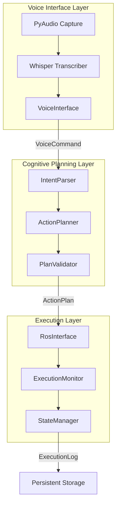
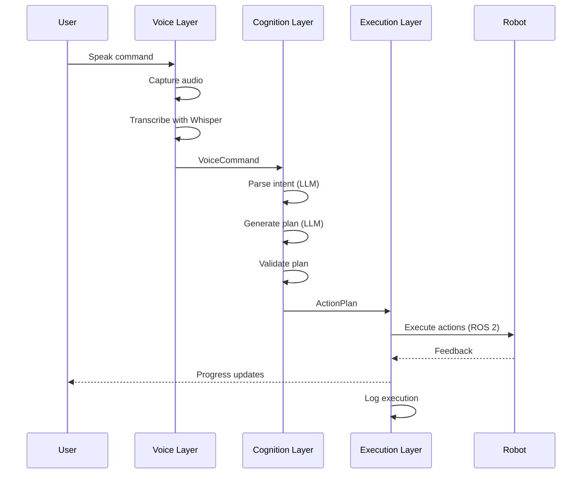

# Architecture Overview

The VLA Integration system follows a **three-layer architecture** that separates concerns and enables modularity.

## System Layers



## Layer Responsibilities

### 1. Voice Interface Layer

**Purpose**: Capture audio and convert to text

**Components**:
- **AudioCapture**: PyAudio-based microphone input with VAD
- **WhisperTranscriber**: Local Whisper model inference
- **VoiceInterface**: Coordinates capture + transcription with retry logic

**Output**: `VoiceCommand` (audio + transcribed text + confidence)

**Key Features**:
- Local processing (no cloud API)
- GPU acceleration support
- Automatic retry on low confidence
- Voice activity detection

### 2. Cognitive Planning Layer

**Purpose**: Parse intent and generate action plans

**Components**:
- **IntentParser**: LLM-based natural language understanding
- **ActionPlanner**: Multi-step task decomposition with LangGraph
- **PlanValidator**: Safety and feasibility checks
- **LLMClient**: OpenAI API wrapper with structured output

**Output**: `ActionPlan` (validated sequence of robot actions)

**Key Features**:
- Structured LLM output with Pydantic
- Multi-step planning with topological sorting
- Clarification detection
- Safety validation (joint limits, workspace, collisions)

### 3. Execution Layer

**Purpose**: Execute plans on robot with monitoring

**Components**:
- **RosInterface**: ROS 2 action client wrapper
- **ExecutionMonitor**: Real-time progress tracking
- **StateManager**: Thread-safe state persistence

**Output**: `ExecutionLog` (complete trace with events)

**Key Features**:
- Async ROS 2 action execution
- Pause/resume/cancel support
- Real-time feedback
- Persistent audit logs

## Data Flow



## Design Principles

### 1. **Separation of Concerns**
Each layer has a single responsibility and communicates via well-defined interfaces.

### 2. **Dependency Inversion**
Components depend on abstractions (interfaces), not concrete implementations.

```python
class IVoiceInterface(ABC):
    async def listen(self) -> VoiceCommand:
        pass

# VlaPipeline depends on IVoiceInterface, not VoiceInterface
class VlaPipeline:
    def __init__(self, voice_interface: IVoiceInterface):
        self.voice_interface = voice_interface
```

### 3. **Asynchronous Processing**
All I/O-bound operations use `async/await` for non-blocking execution.

### 4. **Type Safety**
Pydantic models enforce validation at layer boundaries.

### 5. **Error Handling**
Custom exception hierarchy with recovery hints.

```python
class VlaError(Exception):
    def __init__(self, message: str, recoverable: bool = False, **context):
        ...

class TranscriptionError(VlaError):
    # Recoverable - can retry
    pass

class ValidationError(VlaError):
    # Not recoverable - plan is unsafe
    pass
```

## Configuration Management

All configuration is centralized in `VLAConfig` (Pydantic settings).

```python
class VLAConfig(BaseSettings):
    openai_api_key: str
    whisper_model: str = "medium"
    max_plan_steps: int = 10
    log_level: str = "INFO"
    # ... 40+ configuration options
```

Configuration loaded from `.env` file with validation.

## State Management

`StateManager` provides thread-safe state tracking across pipeline stages.

```python
manager = StateManager()

# Store entities
manager.store_voice_command(command)
manager.store_intent(intent)
manager.store_plan(plan)

# Track execution
state = manager.create_execution_state(plan_id)
manager.update_execution_state(plan_id, state)

# Query state
is_running = manager.is_execution_in_progress()
```

## Logging Strategy

### Structured Logging
Uses `structlog` for JSON-formatted logs with context.

```python
logger = get_logger(__name__)
logger.info(
    "Action completed",
    action_id=str(action.id),
    duration_ms=duration,
    success=True,
)
```

### Pipeline Logger
Specialized logger for pipeline stages.

```python
logger = PipelineLogger(stage="voice")
logger.start("audio_capture")
logger.complete("audio_capture", duration_ms=150)
logger.metric("latency", 150, unit="ms")
```

### Execution Logs
Persistent JSON files with complete trace.

```json
{
  "log_id": "uuid",
  "voice_command_text": "Pick up the red block",
  "plan_steps_summary": ["Navigate", "Pick"],
  "execution_trace": [
    {
      "timestamp": "2025-12-06T14:30:05Z",
      "event_type": "ACTION_START",
      "message": "Starting navigation"
    }
  ],
  "final_status": "completed",
  "total_duration": 14.2
}
```

## Testing Strategy

### Unit Tests
Test individual components in isolation with mocks.

- `tests/unit/test_models.py` - Pydantic model validation
- `tests/unit/test_voice/` - Voice layer components
- `tests/unit/test_cognition/` - Planning components

### Integration Tests
Test complete pipeline flow with mocked external dependencies.

- `tests/integration/test_pipeline_e2e.py` - Full pipeline
- `tests/integration/test_state_manager.py` - State persistence

### Contract Tests
Verify ROS 2 action interface compliance (future).

## Extension Points

### Adding New Action Types

1. Add enum value to `ActionType`
2. Update `IntentParser` prompt template
3. Update `ActionPlanner` prompt template
4. Add validation logic to `PlanValidator`
5. Implement ROS 2 action server

### Custom LLM Prompts

Edit prompt templates:
- `src/vla_core/cognition/prompts/intent_parser_prompt.md`
- `src/vla_core/cognition/prompts/action_planner_prompt.md`

### Alternative LLM Providers

Implement `IIntentParser` and `IActionPlanner` with your LLM.

### Hardware Integration

Implement `IRosInterface` for your robot platform.

## Next Steps

- [Voice Layer Details](voice-layer)
- [Cognition Layer Details](cognition-layer)
- [Execution Layer Details](execution-layer)
- [Sequence Flow Diagram](sequence-flow)