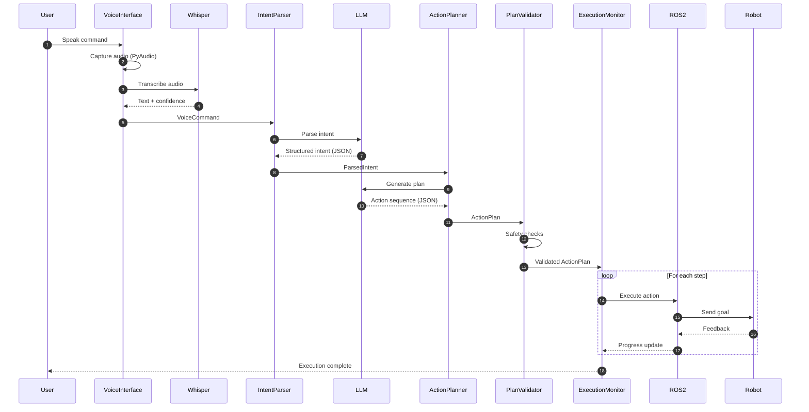

# VLA Sequence Flow

Complete step-by-step walkthrough of the voice-to-action pipeline execution.

## Overview Sequence



## Detailed Flow

### Stage 1: Voice Capture (Audio → Text)

**Duration**: ~1-2 seconds

```python
# 1. User speaks command
audio_bytes = await audio_capture.record_fixed_duration(timeout=10.0)

# 2. Voice Activity Detection filters silence
if is_voice_activity(audio_bytes):
    # 3. Whisper transcription
    text, confidence = await whisper.transcribe(audio_bytes)

# 4. Create VoiceCommand
command = VoiceCommand(
    audio_buffer=audio_bytes,
    transcribed_text=text,
    confidence=confidence,
)
```

**Timing Breakdown**:
- Audio capture: 100-500ms (depends on command length)
- Whisper inference: 500-1500ms (GPU) or 2000-5000ms (CPU)
- Confidence check: &lt;1ms

**Retry Logic**:
- If confidence < 0.7 → retry up to 2 times
- Display "Please repeat" message to user

### Stage 2: Intent Parsing (Text → Structured Intent)

**Duration**: ~1-2 seconds

```python
# 1. Load system prompt
system_prompt = load_intent_parser_prompt()

# 2. Call LLM with structured output
response = await llm_client.structured_completion(
    system_prompt=system_prompt,
    user_message=command.transcribed_text,
    response_model=ParsedIntent,
)

# 3. Validate parameters
response.validate_parameters_for_action()
```

**LLM Input**:
```
System: You are an intent parser for a robot...
User: "Pick up the red block"
```

**LLM Output**:
```json
{
  "action_type": "pick",
  "target_objects": [
    {"name": "red block", "type": "block", "color": "red", "confidence": 0.92}
  ],
  "parameters": {"grasp_type": "top", "approach_offset": {"z": 0.1}},
  "ambiguities": [],
  "requires_clarification": false
}
```

**Timing Breakdown**:
- Prompt loading: &lt;10ms
- LLM API call: 800-1500ms
- Pydantic validation: &lt;5ms
- Parameter validation: &lt;1ms

### Stage 3: Action Planning (Intent → Action Sequence)

**Duration**: ~1-3 seconds

```python
# 1. Format intent as user message
user_message = format_intent_for_planning(intent)

# 2. Call LLM for plan generation
plan_response = await llm_client.structured_completion(
    system_prompt=action_planner_prompt,
    user_message=user_message,
    response_model=PlanResponse,
)

# 3. Convert to ActionPlan with RobotAction steps
plan = convert_to_action_plan(intent, plan_response)
```

**LLM Input**:
```
System: You are an action planner...
User: Action Type: pick
      Target Objects: red block
      Generate a detailed action plan.
```

**LLM Output**:
```json
{
  "steps": [
    {
      "action_type": "navigate",
      "ros_action_name": "/navigate_to_point",
      "goal_message": {"target_pose": {"x": 2.0, "y": 1.0}},
      "timeout": 10.0
    },
    {
      "action_type": "pick",
      "ros_action_name": "/pick_object",
      "goal_message": {"object_id": "red_block_1", "grasp_type": "top"},
      "timeout": 8.0
    }
  ],
  "preconditions": ["Red block visible"],
  "expected_outcomes": ["Red block grasped"],
  "estimated_duration": 18.0
}
```

**Timing Breakdown**:
- Prompt loading: &lt;10ms
- Intent formatting: &lt;1ms
- LLM API call: 1000-2500ms (depends on plan complexity)
- Plan conversion: &lt;5ms

### Stage 4: Plan Validation (Safety Checks)

**Duration**: ~10-50ms

```python
errors = []

# 1. Check step count
if len(plan.steps) > MAX_PLAN_STEPS:
    errors.append("Plan too complex")

# 2. Validate each step
for step in plan.steps:
    # Check required fields
    if not step.ros_action_name:
        errors.append("Missing ROS action name")

    # Check constraints
    if step.constraints.max_force > FORCE_LIMIT:
        errors.append("Excessive force")

    # Check workspace bounds
    if not is_in_workspace(step.goal_message):
        errors.append("Unreachable pose")

# 3. Check topological consistency
if has_place_before_pick(plan):
    errors.append("Invalid step order")

# 4. Update plan
if len(errors) == 0:
    plan.mark_validated()
else:
    for error in errors:
        plan.add_validation_error(error)
```

**Validations Performed**:
- ✓ Step count ≤ 10
- ✓ All required fields present
- ✓ Force limits (≤ 50N)
- ✓ Velocity limits (≤ 0.5 m/s)
- ✓ Workspace bounds
- ✓ Topological consistency (no PLACE before PICK)
- ✓ Preconditions specified
- ✓ Expected outcomes specified

**Timing Breakdown**:
- Step count check: &lt;1ms
- Per-step validation: ~5ms × num_steps
- Topological check: &lt;5ms
- Total: ~10-50ms for typical plans

### Stage 5: Execution Monitoring (Plan → Robot Actions)

**Duration**: Variable (5-60+ seconds)

```python
# 1. Initialize execution state
state = ExecutionState(plan_id=plan.plan_id)
state.start_execution()

# 2. Execute each step
for step_index, action in enumerate(plan.steps):
    # Update state
    state.current_step_index = step_index
    state.current_action_id = action.action_id

    # Log start
    log.add_trace_entry("ACTION_START", step_index, "Starting...")

    # Execute via ROS 2
    success, error = await ros_interface.execute_action(
        action,
        feedback_callback=handle_feedback,
    )

    if success:
        # Mark complete
        state.complete_step(action.action_id)
        state.update_progress(len(plan.steps))
        log.add_trace_entry("ACTION_COMPLETE", step_index, "Done")
    else:
        # Mark failed
        state.mark_failed(error)
        break

# 3. Finalize
state.mark_completed()
log.final_status = state.status
log.total_duration = state.get_duration()
```

**Per-Action Flow**:
1. Send goal to ROS 2 action server
2. Wait for acceptance
3. Receive periodic feedback (progress updates)
4. Receive final result (success/failure)

**Timing Breakdown** (example):
- Navigate to block: ~5-10 seconds
- Pick object: ~3-5 seconds
- Navigate to target: ~5-10 seconds
- Place object: ~3-5 seconds
- **Total**: ~16-30 seconds

### Stage 6: Logging & Persistence

**Duration**: ~10-50ms

```python
# 1. Create execution log
log = ExecutionLog(
    plan_id=plan.plan_id,
    voice_command_text=command.transcribed_text,
    parsed_intent_summary=format_intent_summary(intent),
    plan_steps_summary=[f"{s.action_type}" for s in plan.steps],
    execution_trace=collected_events,
    final_status=state.status,
    total_duration=state.get_duration(),
)

# 2. Save to file
log_path = f"logs/executions/{date}/{plan_id}.json"
with open(log_path, "w") as f:
    json.dump(log.model_dump(), f, indent=2)
```

**Log Contents**:
- Original voice command
- Parsed intent summary
- Plan steps
- Execution trace (all events with timestamps)
- Final status
- Total duration
- Error details (if any)

## Timing Summary

| Stage | Duration | Variability |
|-------|----------|-------------|
| Voice Capture | 1-2s | High (depends on command length) |
| Intent Parsing | 1-2s | Medium (LLM latency) |
| Action Planning | 1-3s | High (plan complexity) |
| Validation | 10-50ms | Low |
| Execution | 5-60s | Very High (physical actions) |
| Logging | 10-50ms | Low |
| **Total** | **8-70s** | - |

**Latency Budget**: Target &lt;3s for voice → validated plan

## Error Handling

### Transcription Errors
- **Retry**: Up to 2 retries on low confidence
- **Fallback**: Return low-confidence result after max retries

### Parsing Errors
- **Retry**: LLM call with increased temperature
- **Clarification**: Set `requires_clarification=true`

### Planning Errors
- **Retry**: Generate alternative plan
- **Simplification**: Reduce plan complexity

### Validation Errors
- **Abort**: Do not execute unsafe plans
- **Feedback**: Report specific validation failures

### Execution Errors
- **Pause**: Wait for operator guidance
- **Replan**: Generate alternative approach
- **Abort**: Cancel on critical failures

## Next Steps

- [Voice Layer Details](voice-layer)
- [Cognition Layer Details](cognition-layer)
- [Execution Layer Details](execution-layer)