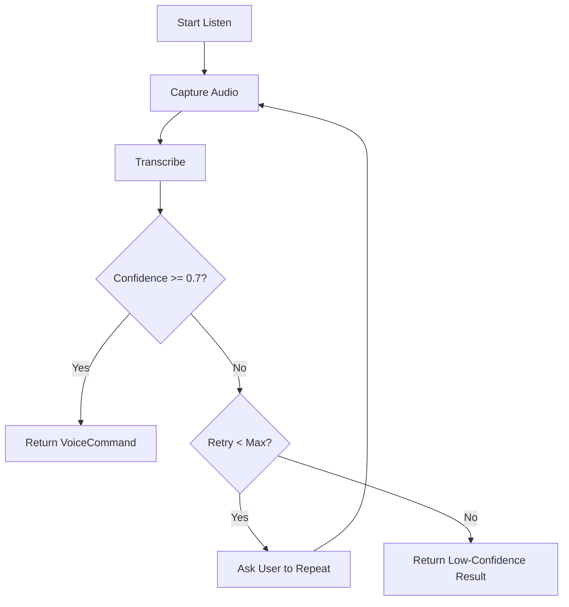
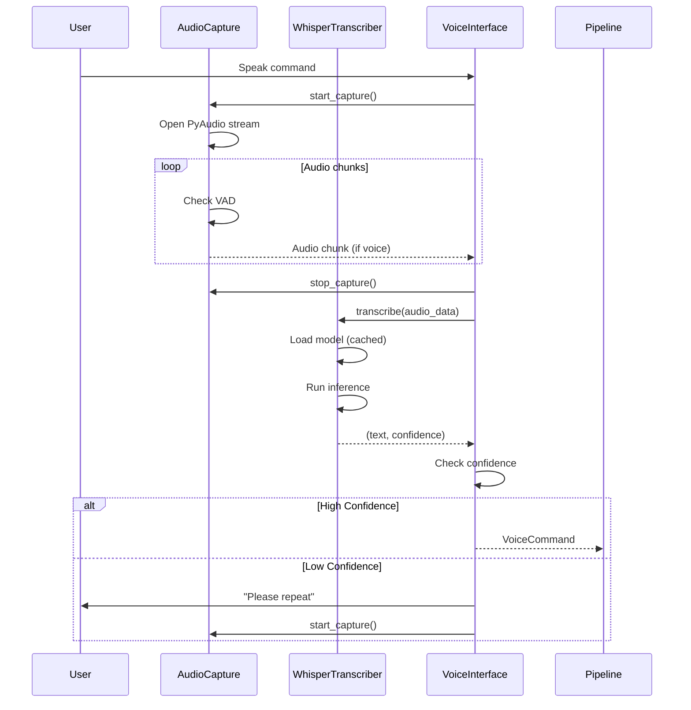

# Voice Interface Layer

The Voice Interface Layer is responsible for capturing audio from the microphone and converting it to text using the Whisper speech recognition model.

## Layer Components


## AudioCapture

**Purpose**: Capture audio from microphone with Voice Activity Detection (VAD)

**Location**: `src/vla_core/voice/audio_capture.py`

### Key Features

- **PyAudio Integration**: Cross-platform microphone access
- **Voice Activity Detection**: Filters silence to reduce processing
- **Async Streaming**: Non-blocking audio chunk delivery
- **Configurable Parameters**: Sample rate, chunk size, VAD threshold

### Implementation

```python
class AudioCapture(IAudioCapture):
    def __init__(self, sample_rate=16000, chunk_size=1024, vad_threshold=0.5):
        self._audio = pyaudio.PyAudio()
        self._sample_rate = sample_rate
        self._chunk_size = chunk_size
        self._vad_threshold = vad_threshold
        self._is_capturing = False
        self._audio_queue = queue.Queue()

    async def start_capture(self, device_index: Optional[int] = None) -> None:
        """Start capturing audio from microphone."""
        self._is_capturing = True
        self._stream = self._audio.open(
            format=pyaudio.paInt16,
            channels=1,
            rate=self._sample_rate,
            input=True,
            input_device_index=device_index,
            frames_per_buffer=self._chunk_size,
            stream_callback=self._audio_callback,
        )

    def _audio_callback(self, in_data, frame_count, time_info, status):
        """PyAudio callback - runs in separate thread."""
        self._audio_queue.put(in_data)
        return (None, pyaudio.paContinue)

    async def get_audio_stream(self) -> AsyncIterator[bytes]:
        """Yield audio chunks asynchronously."""
        while self._is_capturing:
            try:
                audio_chunk = await asyncio.get_event_loop().run_in_executor(
                    None, self._audio_queue.get, True, 0.1
                )
                if self._is_voice_activity(audio_chunk):
                    yield audio_chunk
            except queue.Empty:
                continue
```

### Voice Activity Detection

Simple energy-based VAD implementation:

```python
def _is_voice_activity(self, audio_chunk: bytes) -> bool:
    """Check if audio chunk contains voice activity."""
    audio_array = np.frombuffer(audio_chunk, dtype=np.int16)
    energy = np.abs(audio_array).mean()
    normalized_energy = energy / 32768.0  # Normalize to [0, 1]
    return normalized_energy > self._vad_threshold
```

### Configuration

```python
# In .env
AUDIO_SAMPLE_RATE=16000
AUDIO_CHUNK_SIZE=1024
VAD_THRESHOLD=0.5
AUDIO_DEVICE_INDEX=null  # null = default device
```

## WhisperTranscriber

**Purpose**: Convert audio to text using OpenAI Whisper model

**Location**: `src/vla_core/voice/transcription.py`

### Key Features

- **Local Processing**: No cloud API dependency
- **GPU Acceleration**: CUDA support for faster inference
- **Multiple Model Sizes**: tiny, base, small, medium, large
- **Confidence Estimation**: Heuristic confidence scoring
- **Language Support**: Multi-language with English default

### Implementation

```python
class WhisperTranscriber(ITranscriber):
    def __init__(self, model_name: str = "medium", device: Optional[str] = None):
        if device is None:
            device = "cuda" if torch.cuda.is_available() else "cpu"

        logger.info(f"Loading Whisper model '{model_name}' on {device}")
        self._model = whisper.load_model(model_name, device=device)
        self._device = device

    async def transcribe(self, audio_data: bytes) -> Tuple[str, float]:
        """Transcribe audio bytes to text with confidence."""
        # Convert bytes to numpy array
        audio_array = np.frombuffer(audio_data, dtype=np.int16)
        audio_float = audio_array.astype(np.float32) / 32768.0

        # Run Whisper in executor (blocking operation)
        result = await asyncio.get_event_loop().run_in_executor(
            None,
            lambda: self._model.transcribe(
                audio_float,
                language="en",
                fp16=(self._device == "cuda"),
            ),
        )

        text = result["text"].strip()
        confidence = self._estimate_confidence(result)

        logger.info(
            "Transcription complete",
            text=text,
            confidence=confidence,
            language=result.get("language"),
        )

        return (text, confidence)
```

### Confidence Estimation

Whisper doesn't provide direct confidence scores, so we estimate based on:

```python
def _estimate_confidence(self, whisper_result: dict) -> float:
    """Estimate confidence from Whisper result."""
    # Whisper doesn't provide confidence directly
    # Heuristic based on segments and language probability

    segments = whisper_result.get("segments", [])
    if not segments:
        return 0.5  # Default moderate confidence

    # Average no_speech_prob across segments (lower is better)
    no_speech_probs = [s.get("no_speech_prob", 0.5) for s in segments]
    avg_no_speech = sum(no_speech_probs) / len(no_speech_probs)

    # Convert to confidence (inverse of no_speech_prob)
    confidence = 1.0 - avg_no_speech

    # Clamp to reasonable range [0.3, 0.99]
    return max(0.3, min(0.99, confidence))
```

### Model Selection

| Model | Size | VRAM | Speed (RTX 3090) | Accuracy |
|-------|------|------|------------------|----------|
| tiny | 39M | ~1GB | ~32x realtime | Low |
| base | 74M | ~1GB | ~16x realtime | Medium |
| small | 244M | ~2GB | ~6x realtime | Good |
| medium | 769M | ~5GB | ~2x realtime | Very Good |
| large | 1550M | ~10GB | ~1x realtime | Excellent |

**Recommendation**: `medium` for GPU, `base` for CPU

### Configuration

```python
# In .env
WHISPER_MODEL=medium
WHISPER_DEVICE=cuda  # or 'cpu'
WHISPER_LANGUAGE=en
WHISPER_FP16=true  # Enable for GPU
```

## VoiceInterface

**Purpose**: High-level interface coordinating capture and transcription

**Location**: `src/vla_core/voice/voice_interface.py`

### Key Features

- **Retry Logic**: Automatic retry on low confidence
- **Timeout Handling**: Configurable recording timeout
- **State Management**: Start/stop voice capture
- **Event Callbacks**: Progress notifications

### Implementation

```python
class VoiceInterface(IVoiceInterface):
    def __init__(self, config: VLAConfig):
        self.config = config
        self.audio_capture = AudioCapture(
            sample_rate=config.audio_sample_rate,
            chunk_size=config.audio_chunk_size,
            vad_threshold=config.vad_threshold,
        )
        self.transcriber = WhisperTranscriber(
            model_name=config.whisper_model,
            device=config.whisper_device,
        )
        self._is_listening = False

    async def listen(self, timeout: Optional[float] = None) -> VoiceCommand:
        """Listen for voice command with retry logic."""
        retry_attempts = self.config.transcription_retry_attempts
        confidence_threshold = self.config.whisper_confidence_threshold

        for attempt in range(retry_attempts + 1):
            logger.info(
                "Listening for command",
                attempt=attempt + 1,
                max_attempts=retry_attempts + 1,
            )

            # Capture audio
            audio_data = await self.audio_capture.record_fixed_duration(
                timeout=timeout or self.config.voice_command_timeout
            )

            # Transcribe
            text, confidence = await self.transcriber.transcribe(audio_data)

            # Create command
            command = VoiceCommand(
                audio_buffer=audio_data,
                transcribed_text=text,
                confidence=confidence,
            )

            # Check confidence
            if command.is_high_confidence(confidence_threshold):
                logger.info(
                    "Command accepted",
                    text=text,
                    confidence=confidence,
                )
                return command
            else:
                logger.warning(
                    "Low confidence transcription",
                    text=text,
                    confidence=confidence,
                    attempt=attempt + 1,
                )

                if attempt < retry_attempts:
                    # Ask user to repeat
                    print(f"Low confidence ({confidence:.2f}). Please repeat.")

        # Return low-confidence result after max retries
        logger.warning("Max retries reached, returning low-confidence result")
        return command
```

### Retry Strategy



### Configuration

```python
# In .env
VOICE_COMMAND_TIMEOUT=10.0
TRANSCRIPTION_RETRY_ATTEMPTS=2
WHISPER_CONFIDENCE_THRESHOLD=0.7
```

## Data Flow

### Complete Voice Pipeline



## Performance Optimization

### 1. Model Caching

Whisper models are loaded once and cached:

```python
# First call: ~2-5 seconds (model loading)
transcriber = WhisperTranscriber(model_name="medium")

# Subsequent calls: ~500-1500ms (inference only)
text, conf = await transcriber.transcribe(audio)
```

### 2. GPU Acceleration

Enable CUDA for 5-10x speedup:

```bash
# Install CUDA-enabled PyTorch
pip install torch torchvision torchaudio --index-url https://download.pytorch.org/whl/cu118

# Configure
WHISPER_DEVICE=cuda
WHISPER_FP16=true
```

### 3. VAD Filtering

Voice Activity Detection reduces Whisper calls by ~70%:

```python
# Without VAD: Process all audio chunks
# With VAD: Only process chunks with voice energy > threshold
```

## Error Handling

### Common Errors

**1. Microphone Access Denied**
```python
try:
    await audio_capture.start_capture()
except OSError as e:
    raise TranscriptionError(
        "Microphone access denied. Check permissions.",
        recoverable=False,
        original_error=str(e),
    )
```

**2. CUDA Out of Memory**
```python
try:
    model = whisper.load_model("large", device="cuda")
except RuntimeError as e:
    if "CUDA out of memory" in str(e):
        logger.warning("CUDA OOM, falling back to CPU")
        model = whisper.load_model("large", device="cpu")
```

**3. Timeout**
```python
try:
    audio_data = await asyncio.wait_for(
        audio_capture.record_fixed_duration(timeout=10.0),
        timeout=12.0,  # Slightly longer
    )
except asyncio.TimeoutError:
    raise TranscriptionError(
        "Voice command timeout - no input detected",
        recoverable=True,
    )
```

## Testing

### Unit Tests

```python
# tests/unit/test_voice/test_audio_capture.py
@pytest.mark.asyncio
async def test_audio_capture_vad():
    capture = AudioCapture(vad_threshold=0.5)

    # Silent audio
    silent = b'\x00' * 2048
    assert not capture._is_voice_activity(silent)

    # Loud audio
    loud = b'\xff\x7f' * 1024
    assert capture._is_voice_activity(loud)
```

### Integration Tests

```python
# tests/integration/test_voice_pipeline.py
@pytest.mark.asyncio
async def test_voice_interface_end_to_end():
    interface = VoiceInterface(config)

    # Mock audio and transcriber
    interface.audio_capture.record_fixed_duration = AsyncMock(
        return_value=b"test_audio"
    )
    interface.transcriber.transcribe = AsyncMock(
        return_value=("Pick up the red block", 0.95)
    )

    command = await interface.listen(timeout=5.0)

    assert command.transcribed_text == "Pick up the red block"
    assert command.confidence == 0.95
    assert command.is_high_confidence()
```

## Troubleshooting

### Issue: Low Transcription Accuracy

**Symptoms**: Confidence < 0.7, incorrect words

**Solutions**:
1. Check microphone quality/positioning
2. Reduce background noise
3. Upgrade to larger Whisper model (`medium` → `large`)
4. Adjust VAD threshold (try 0.3 for quieter speech)

### Issue: Slow Transcription

**Symptoms**: >5 seconds per command

**Solutions**:
1. Use GPU acceleration (`WHISPER_DEVICE=cuda`)
2. Downgrade model size (`medium` → `base`)
3. Reduce audio chunk size
4. Check CPU/GPU load

### Issue: Microphone Not Detected

**Symptoms**: `OSError: No Default Input Device Available`

**Solutions**:
```bash
# List available devices
python -c "import pyaudio; p=pyaudio.PyAudio(); [print(f'{i}: {p.get_device_info_by_index(i)[\"name\"]}') for i in range(p.get_device_count())]"

# Set specific device in .env
AUDIO_DEVICE_INDEX=1
```

## Next Steps

- [Cognition Layer Details](cognition-layer)
- [Execution Layer Details](execution-layer)
- [Complete Sequence Flow](sequence-flow)