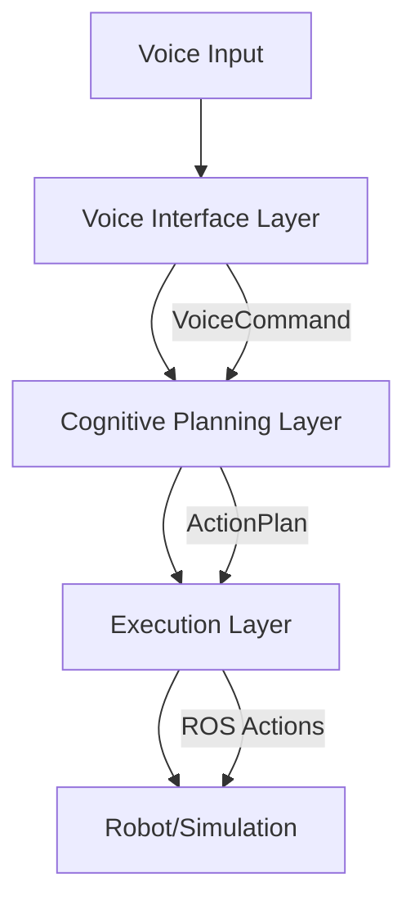

# Introduction

Welcome to **VLA Integration** - a multi-modal voice-to-action pipeline for controlling humanoid robots through natural language commands.

## What is VLA Integration?

VLA (Vision-Language-Action) Integration is a complete system that bridges the gap between human voice commands and robot actions. It combines:

- **Voice Recognition**: Local Whisper model for accurate speech-to-text
- **Cognitive Planning**: LLM-based intent parsing and multi-step planning
- **Safety Validation**: Pre-execution checks for feasibility and safety
- **Robot Control**: ROS 2 action execution with real-time monitoring
- **Complete Traceability**: Structured logging with full audit trails

## Key Features

### 🎤 Voice Interface
- **Local Processing**: Whisper model runs locally - no cloud dependency
- **GPU Acceleration**: CUDA support for fast transcription
- **Confidence Scoring**: Automatic retry on low-confidence transcriptions
- **Voice Activity Detection**: Filters silence to reduce processing

### 🧠 Cognitive Planning
- **Intent Parsing**: LLM extracts structured intent from natural language
- **Multi-Step Planning**: Decomposes complex tasks into atomic actions
- **Clarification Handling**: Detects ambiguous commands and requests clarification
- **Replanning**: Generates alternative plans when execution fails

### ✅ Safety Validation
- **Joint Limit Checks**: Ensures commands stay within robot capabilities
- **Workspace Bounds**: Validates target positions are reachable
- **Collision Avoidance**: Simple bounding box collision detection
- **Force Limits**: Prevents excessive gripper force

### 🤖 Execution Monitoring
- **Real-Time Progress**: Live feedback on execution status
- **Pause/Resume/Cancel**: Full control during execution
- **Execution Logs**: Complete trace with timestamps and events
- **Error Recovery**: Graceful degradation on failure

## System Architecture

The VLA pipeline follows a three-layer design:



### Voice Interface Layer
Captures audio from microphone and transcribes using Whisper.

**Components**: AudioCapture, WhisperTranscriber, VoiceInterface

### Cognitive Planning Layer
Parses intent and generates validated action plans using LLM.

**Components**: IntentParser, ActionPlanner, PlanValidator, LLMClient

### Execution Layer
Executes actions on robot via ROS 2 with progress monitoring.

**Components**: RosInterface, ExecutionMonitor, StateManager

## Quick Example

```bash
# Start the pipeline
python -m src.cli.vla_cli run

# Speak a command
"Pick up the red block"

# System processes:
# 1. Captures audio → transcribes with Whisper
# 2. Parses intent → action_type: PICK, object: "red block"
# 3. Generates plan → [Navigate to block, Pick block]
# 4. Validates plan → checks reachability, safety
# 5. Executes plan → sends ROS actions to robot
# 6. Logs execution → saves complete trace
```

## Use Cases

### Industrial Robotics
- Voice-controlled pick-and-place tasks
- Assembly line assistance
- Warehouse automation

### Research
- Human-robot interaction studies
- Natural language understanding for robotics
- Multi-modal control systems

### Education
- Teaching robotics concepts
- Demonstrating voice-controlled systems
- ROS 2 integration examples

## Getting Started

Ready to try it? Check out the [Installation Guide](tutorials/installation) to get started.

For a deeper dive into the architecture, see the [Architecture Overview](architecture/overview).

## System Requirements

- **OS**: Ubuntu 22.04 LTS or Windows with WSL
- **Python**: 3.11 or later
- **Hardware**: GPU recommended, microphone required, 8GB+ RAM
- **ROS 2**: Humble Hawksbill (for physical robot integration)

## Technology Stack

| Component | Technology |
|-----------|------------|
| Voice | OpenAI Whisper (local) |
| Audio | PyAudio |
| Planning | LangGraph + GPT-4 |
| Validation | Pydantic + Custom Logic |
| Execution | ROS 2 (rclpy) |
| Simulation | Gazebo Ignition |
| Testing | pytest |

## License

MIT License - See LICENSE file for details.

## Contributing

This is a research prototype. For questions or issues, contact the development team.

---

**Version**: 0.1.0 (MVP)
**Last Updated**: 2025-12-06