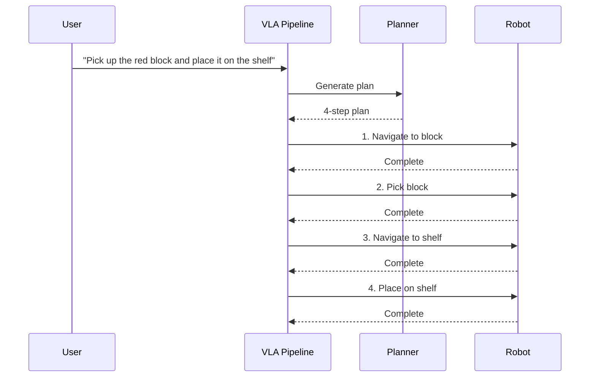
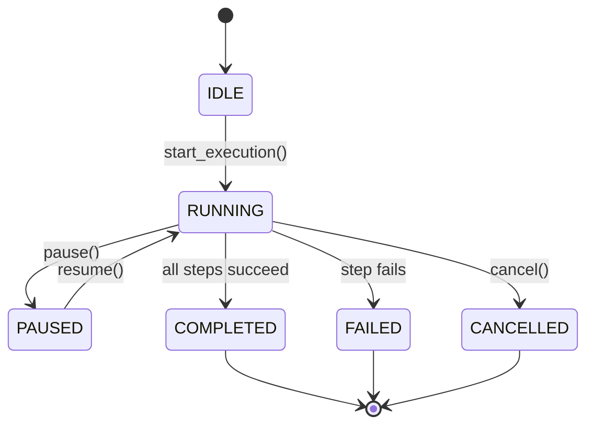

# Multi-Step Task Tutorial

Learn how to execute complex, multi-step tasks that require planning and coordination.

## Overview

Multi-step tasks involve breaking down complex commands into sequences of atomic robot actions. The VLA system uses LLM-based planning to decompose high-level goals into executable steps.

## Simple Multi-Step Tasks

### Pick and Place

**Command**: "Pick up the red block and place it on the shelf"

#### Execution Flow



#### Generated Plan

```json
{
  "steps": [
    {
      "action_type": "NAVIGATE",
      "ros_action_name": "/navigate_to_point",
      "goal_message": {"target_location": "near table"},
      "timeout": 10.0
    },
    {
      "action_type": "PICK",
      "ros_action_name": "/pick_object",
      "goal_message": {"object_id": "red_block_1", "grasp_type": "top"},
      "timeout": 8.0
    },
    {
      "action_type": "NAVIGATE",
      "ros_action_name": "/navigate_to_point",
      "goal_message": {"target_location": "shelf"},
      "timeout": 10.0
    },
    {
      "action_type": "PLACE",
      "ros_action_name": "/place_object",
      "goal_message": {"placement_location": "shelf_top", "placement_type": "gentle"},
      "timeout": 8.0
    }
  ],
  "preconditions": [
    "Red block is visible",
    "Gripper is empty",
    "Shelf is accessible"
  ],
  "expected_outcomes": [
    "Red block placed on shelf"
  ],
  "estimated_duration": 36.0
}
```

#### Console Output

```
🎤 Transcription: "Pick up the red block and place it on the shelf" (0.94)
🧠 Intent: PICK + PLACE (red block → shelf)
🧠 Plan: 4 steps (est. 36.0s)
✓ Validation: PASS

🤖 Executing plan...

[1/4] NAVIGATE → /navigate_to_point
      Target: near table
      Progress: ████████████████████ 100% (8.2s)
✓ Step 1 complete

[2/4] PICK → /pick_object
      Object: red_block_1 (top grasp)
      Progress: ████████████████████ 100% (5.3s)
✓ Step 2 complete

[3/4] NAVIGATE → /navigate_to_point
      Target: shelf
      Progress: ████████████████████ 100% (9.1s)
✓ Step 3 complete

[4/4] PLACE → /place_object
      Location: shelf_top (gentle)
      Progress: ████████████████████ 100% (6.8s)
✓ Step 4 complete

✓ Task complete! (29.4s total)
```

## Complex Multi-Step Tasks

### Sorting Objects

**Command**: "Sort the blocks by color - put red blocks on the left shelf and blue blocks on the right shelf"

#### Generated Plan

This requires:
1. Visual inspection to identify all blocks
2. Multiple pick-and-place sequences
3. Coordination between shelves

```json
{
  "steps": [
    {
      "action_type": "INSPECT",
      "ros_action_name": "/inspect_object",
      "goal_message": {"object_query": "all blocks", "detection_area": "table"}
    },
    {
      "action_type": "NAVIGATE",
      "goal_message": {"target_location": "near first red block"}
    },
    {
      "action_type": "PICK",
      "goal_message": {"object_id": "red_block_1"}
    },
    {
      "action_type": "NAVIGATE",
      "goal_message": {"target_location": "left shelf"}
    },
    {
      "action_type": "PLACE",
      "goal_message": {"placement_location": "left_shelf"}
    },
    // ... repeat for other red blocks
    {
      "action_type": "NAVIGATE",
      "goal_message": {"target_location": "near first blue block"}
    },
    {
      "action_type": "PICK",
      "goal_message": {"object_id": "blue_block_1"}
    },
    {
      "action_type": "NAVIGATE",
      "goal_message": {"target_location": "right shelf"}
    },
    {
      "action_type": "PLACE",
      "goal_message": {"placement_location": "right_shelf"}
    }
    // ... repeat for other blue blocks
  ],
  "estimated_duration": 120.0
}
```

### Delivery Task

**Command**: "Bring me the blue cup from the kitchen"

Requires navigation to different room:

```json
{
  "steps": [
    {
      "action_type": "NAVIGATE",
      "goal_message": {"target_location": "kitchen"}
    },
    {
      "action_type": "INSPECT",
      "goal_message": {"object_query": "blue cup"}
    },
    {
      "action_type": "PICK",
      "goal_message": {"object_id": "blue_cup_1", "grasp_type": "side"}
    },
    {
      "action_type": "NAVIGATE",
      "goal_message": {"target_location": "user location"}
    },
    {
      "action_type": "HANDOVER",
      "goal_message": {"recipient": "user", "handover_height": 1.2}
    }
  ]
}
```

## Plan Validation

### Safety Checks

Before execution, the system validates:

#### 1. Step Count Limit

```python
# Maximum 10 steps per plan (configurable)
if len(plan.steps) > MAX_PLAN_STEPS:
    raise ValidationError("Plan too complex")
```

#### 2. Topological Consistency

```python
# Cannot PLACE without PICK first
has_picked = False
for step in plan.steps:
    if step.action_type == PLACE and not has_picked:
        raise ValidationError("Invalid: PLACE before PICK")
    if step.action_type == PICK:
        has_picked = True
```

#### 3. Workspace Bounds

```python
# All target positions must be reachable
if not is_in_workspace(step.target_pose):
    raise ValidationError("Target outside workspace")
```

#### 4. Force and Velocity Limits

```python
# Safety constraints
if step.max_force > MAX_FORCE_THRESHOLD:
    raise ValidationError("Excessive force")
if step.max_velocity > MAX_VELOCITY_THRESHOLD:
    raise ValidationError("Unsafe velocity")
```

### Example Validation Failure

**Command**: "Pick up 15 blocks and stack them in a pyramid"

```
✗ Plan validation failed:
   - Step count exceeds limit: 45 steps > 10 max
   - Step 23: Target pose outside workspace bounds
   - Step 31: Timeout too long (90.0s > 60.0s max)

Suggestion: Break task into smaller sub-tasks
```

## Execution Monitoring

### Real-Time Progress

The system provides feedback at each step:

```python
def state_callback(state: ExecutionState):
    print(f"Progress: {state.progress_percent:.1f}%")
    print(f"Current step: {state.current_step_index + 1}/{len(plan.steps)}")
    print(f"Status: {state.status}")
```

### Execution State Machine



### Pause/Resume/Cancel

```python
# During execution, you can control the pipeline:
monitor = pipeline.execution_monitor

# Pause after current action
await monitor.pause_execution()

# Resume
await monitor.resume_execution()

# Cancel entire plan
await monitor.cancel_execution()
```

## Error Recovery

### Step Failure Handling

If a step fails mid-execution:

```
[2/5] PICK → /pick_object
      Object: red_block_1
      Progress: ████████░░ 75% (Closing gripper)
✗ Step 2 failed: Grasp unsuccessful - object slipped

✗ Plan execution failed at step 2/5
   Error: Grasp unsuccessful - object slipped
   Recoverable: true

Attempting recovery...
```

### Recovery Strategies

#### 1. Retry Failed Step

```python
max_retries = 2
for attempt in range(max_retries + 1):
    success, error = await execute_action(action)
    if success:
        break
```

#### 2. Replan

Generate alternative plan:

```python
if execution_failed and error.recoverable:
    # Ask planner for alternative approach
    alternative_plan = await planner.generate_plan(
        intent,
        failed_step=failed_step_index,
        failure_reason=error.message
    )
```

#### 3. Human Intervention

```
✗ Cannot recover automatically
   Intervention required: Object out of reach

Waiting for operator guidance...
  [R] Retry
  [S] Skip step
  [C] Cancel plan
```

## Complex Command Examples

### Example 1: Conditional Logic

**Command**: "If the red block is on the table, move it to the shelf, otherwise get it from the bin"

The LLM planner generates:

```json
{
  "steps": [
    {
      "action_type": "INSPECT",
      "goal_message": {"object_query": "red block on table"}
    },
    {
      "action_type": "PICK",
      "goal_message": {
        "object_id": "detected_object_1",
        "fallback_location": "bin"
      }
    },
    {
      "action_type": "NAVIGATE",
      "goal_message": {"target_location": "shelf"}
    },
    {
      "action_type": "PLACE",
      "goal_message": {"placement_location": "shelf"}
    }
  ]
}
```

### Example 2: Sequential Dependencies

**Command**: "Clear the table by moving everything to the bin"

Requires iterative processing:

```json
{
  "steps": [
    {
      "action_type": "INSPECT",
      "goal_message": {"detection_area": "table", "find_all": true}
    },
    // For each detected object:
    {
      "action_type": "PICK",
      "goal_message": {"object_id": "object_N"}
    },
    {
      "action_type": "NAVIGATE",
      "goal_message": {"target_location": "bin"}
    },
    {
      "action_type": "PLACE",
      "goal_message": {"placement_type": "drop"}
    }
    // Repeat until table is empty
  ]
}
```

### Example 3: Precision Tasks

**Command**: "Stack the three blocks in order: red on bottom, blue in middle, green on top"

Requires careful sequencing:

```json
{
  "steps": [
    {"action_type": "PICK", "goal_message": {"object_id": "red_block"}},
    {"action_type": "PLACE", "goal_message": {"placement_location": "stack_base"}},
    {"action_type": "PICK", "goal_message": {"object_id": "blue_block"}},
    {"action_type": "PLACE", "goal_message": {
      "placement_location": "on_red_block",
      "placement_type": "gentle",
      "approach_offset": {"z": 0.05}
    }},
    {"action_type": "PICK", "goal_message": {"object_id": "green_block"}},
    {"action_type": "PLACE", "goal_message": {
      "placement_location": "on_blue_block",
      "placement_type": "gentle",
      "approach_offset": {"z": 0.05}
    }}
  ]
}
```

## Performance Considerations

### Latency Breakdown

For a 4-step pick-and-place task:

| Stage | Duration |
|-------|----------|
| Voice capture | 1.5s |
| Intent parsing | 1.2s |
| Action planning | 2.1s |
| Validation | 0.03s |
| Step 1 (Navigate) | 8.2s |
| Step 2 (Pick) | 5.3s |
| Step 3 (Navigate) | 9.1s |
| Step 4 (Place) | 6.8s |
| **Total** | **34.23s** |

### Optimization Tips

1. **GPU Acceleration**: Use CUDA for Whisper (5-10x speedup)
2. **Model Selection**: Use `gpt-4-turbo-preview` (faster than `gpt-4`)
3. **Parallel Actions**: Some actions can run concurrently
4. **Caching**: LLM responses are cached for repeated commands

## Logging and Analysis

### Execution Log Structure

```json
{
  "log_id": "uuid",
  "plan_id": "uuid",
  "voice_command_text": "Pick up the red block and place it on the shelf",
  "plan_steps_summary": ["NAVIGATE", "PICK", "NAVIGATE", "PLACE"],
  "execution_trace": [
    {
      "timestamp": "2025-12-08T10:30:00Z",
      "event_type": "PLAN_START",
      "step_index": 0,
      "message": "Starting 4-step plan"
    },
    {
      "timestamp": "2025-12-08T10:30:01Z",
      "event_type": "ACTION_START",
      "step_index": 0,
      "message": "NAVIGATE: /navigate_to_point"
    },
    {
      "timestamp": "2025-12-08T10:30:09Z",
      "event_type": "ACTION_COMPLETE",
      "step_index": 0,
      "message": "Navigation complete"
    }
  ],
  "final_status": "completed",
  "total_duration": 29.4
}
```

### Analyzing Logs

```bash
# Find slowest steps
jq '.execution_trace[] | select(.event_type == "ACTION_COMPLETE")' logs/*.json

# Calculate average task duration
jq '.total_duration' logs/*.json | awk '{sum+=$1} END {print sum/NR}'

# Find failed executions
jq 'select(.final_status == "failed")' logs/*.json
```

## Next Steps

- [Troubleshooting Guide](troubleshooting)
- [Architecture Overview](../architecture/overview)
- [API Reference](../api/overview)